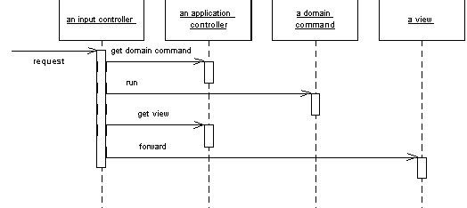

Application Controller

A centralized point for handling screen navigation and the flow of an application.

For a full description see P of EAA page 379

 

Some applications contain a significant amount of logic about the screens to use at different points, which may involve invoking certain screens at certain times in an application. This is the wizard style of interaction, where the user is led through a series of screens in a certain order. In other cases we may see screens that are only brought in under certain conditions, or choices between different screens that depend on earlier input.

To some degree the various Model View Controller (330) input controllers can make some of these decisions, but as an application gets more complex this can lead to duplicated code as several controllers for different screens need to know what to do in a certain situation.

You can remove this duplication by placing all the flow logic in an Applica-tion Controller. Input controllers then ask the Application Controller for the appropriate commands for execution against a model and the correct view to use depending on the application context.