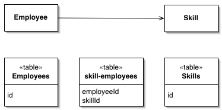

Association Table Mapping

Saves an association as a table with foreign keys to the tables that are linked by the association.

For a full description see P of EAA page 248

 

Objects can handle multivalued fields quite easily by using collections as field values. Relational databases don't have this feature and are constrained to sin-gle- valued fields only. When you're mapping a one-to-many association you can handle this using Foreign Key Mapping (236), essentially using a foreign key for the single-valued end of the association. But a many-to-many association can't do this because there is no single-valued end to hold the foreign key.

The answer is the classic resolution that's been used by relational data people for decades: create an extra table to record the relationship. Then use Associa-tion Table Mapping to map the multivalued field to this link table.