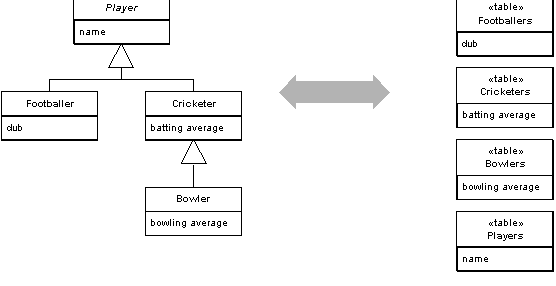

Class Table Inheritance

Represents an inheritance hierarchy of classes with one table for each class.

For a full description see P of EAA page 285

 

A very visible aspect of the object-relational mismatch is the fact that relational databases don't support inheritance. You want database structures that map clearly to the objects and allow links anywhere in the inheritance structure. Class Table Inheritance supports this by using one database table per class in the inheritance structure.