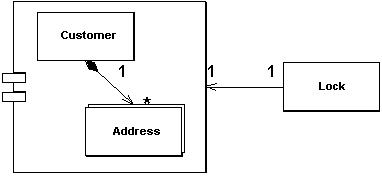

Coarse-Grained Lock

by David Rice and Matt Foemmel

Locks a set of related objects with a single lock.

For a full description see P of EAA page 438

 

Objects can often be edited as a group. Perhaps you have a customer and its set of addresses. If so, when using the application it makes sense to lock all of these items if you want to lock any one of them. Having a separate lock for individual objects presents a number of challenges. First, anyone manipulating them has to write code that can find them all in order to lock them. This is easy enough for a customer and its addresses, but it gets tricky as you get more locking groups. And what if the groups get complicated? Where is this behavior when your framework is managing lock acquisition? If your locking strategy requires that an object be loaded in order to be locked, such as with Optimistic Offline Lock (416), locking a large group affects performance. And with Pessimistic Offline Lock (426) a large lock set is a management headache and increases lock table contention.

A Coarse-Grained Lock is a single lock that covers many objects. It not only simplifies the locking action itself but also frees you from having to load all the members of a group in order to lock them.