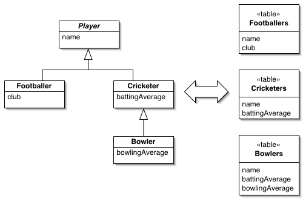

Concrete Table Inheritance

Represents an inheritance hierarchy of classes with one table per concrete class in the hierarchy.

For a full description see P of EAA page 293

 

As any object purist will tell you, relational databases don't support inherit-ance - a fact that complicates object-relational mapping. Thinking of tables from an object instance point of view, a sensible route is to take each object in memory and map it to a single database row. This implies Concrete Table Inher-itance, where there's a table for each concrete class in the inheritance hierarchy.

I'll confess to having had some difficulty naming this pattern. Most people think of it as leaf oriented since you usually have one table per leaf class in a hierarchy. Following that logic, I could call this pattern leaf table inheritance, and the term "leaf" is often used for this pattern. Strictly, however, a concrete class that isn't a leaf usually gets a table as well, so I decided to go with the more correct, if less intuitive term.