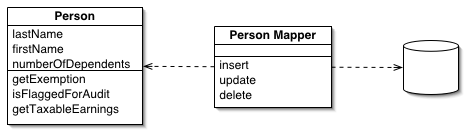

Data Mapper

A layer of Mappers (473) that moves data between objects and a database while keeping them independent of each other and the mapper itself.

For a full description see P of EAA page 165