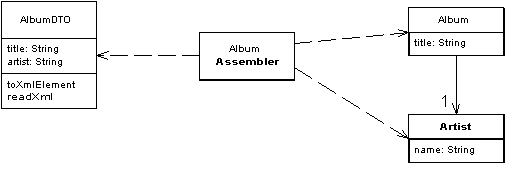

Data Transfer Object

An object that carries data between processes in order to reduce the number of method calls.

For a full description see P of EAA page 401

When you're working with a remote interface, such as Remote Facade (388), each call to it is expensive. As a result you need to reduce the number of calls, and that means that you need to transfer more data with each call. One way to do this is to use lots of parameters. However, this is often awkward to program - indeed, it's often impossible with languages such as Java that return only a single value.

The solution is to create a Data Transfer Object that can hold all the data for the call. It needs to be serializable to go across the connection. Usually an assembler is used on the server side to transfer data between the DTO and any domain objects.

Many people in the Sun community use the term "Value Object" for this pattern. I use it to mean something else. See the discussion on page 487.

Although the main reason for using a Data Transfer Object is to batch up what would be multiple remote calls into a single call, it's worth mentioning that another advantage is to encapsulate the serialization mechanism for transferring data over the wire. By encapsulating the serialization like this, the DTOs keep this logic out of the rest of the code and also provide a clear point to change serialization should you wish.

The Sun/Java community's use of terminology has changed since the book was published. They switched to using "Transfer Object" as the name for this pattern. Consequently "Value Object" became regularly used in the way that I describe in this book.