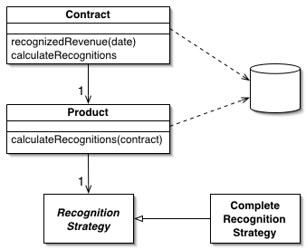
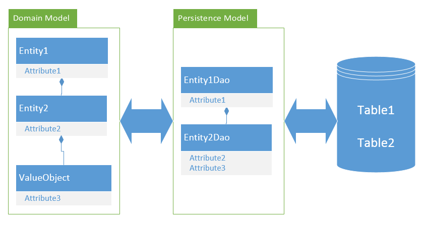

Domain Model

An object model of the domain that incorporates both behavior and data.

At its worst business logic can be very complex. Rules and logic describe many different cases and slants of behavior, and it's this complexity that objects were designed to work with. A Domain Model creates a web of interconnected objects, where each object represents some meaningful individual, whether as large as a corporation or as small as a single line on an order form.
