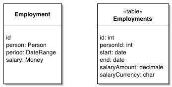

Embedded Value

Maps an object into several fields of another object's table.

For a full description see P of EAA page 268

 

Many small objects make sense in an OO system that don't make sense as tables in a database. Examples include currency-aware money objects and date ranges. Although the default thinking is to save an object as a table, no sane person would want a table of money values.

An Embedded Value maps the values of an object to fields in the record of the object's owner. In the sketch we have an employment object with links to a date range object and a money object. In the resulting table the fields in those objects map to fields in the employment table rather than make new records themselves.