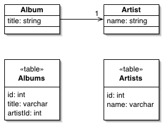

Foreign Key Mapping

Maps an association between objects to a foreign key reference between tables.

For a full description see P of EAA page 236

 

Objects can refer to each other directly by object references. Even the simplest object-oriented system will contain a bevy of objects connected to each other in all sorts of interesting ways. To save these objects to a database, it's vital to save these references. However, since the data in them is specific to the specific instance of the running program, you can't just save raw data values. Further complicating things is the fact that objects can easily hold collections of refer-ences to other objects. Such a structure violates the first normal form of rela-tional databases.

A Foreign Key Mapping maps an object reference to a foreign key in the database.