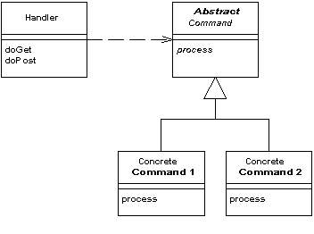

Front Controller

A controller that handles all requests for a Web site.

For a full description see P of EAA page 344

In a complex Web site there are many similar things you need to do when handling a request. These things include security, internationalization, and providing particular views for certain users. If the input controller behavior is scattered across multiple objects, much of this behavior can end up duplicated. Also, it's difficult to change behavior at runtime.

The Front Controller consolidates all request handling by channeling requests through a single handler object. This object can carry out common behavior, which can be modified at runtime with decorators. The handler then dispatches to command objects for behavior particular to a request.