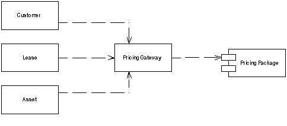

Gateway

An object that encapsulates access to an external system or resource.

For a full description see P of EAA page 466

 

Interesting software rarely lives in isolation. Even the purest object-oriented system often has to deal with things that aren't objects, such as relational data-base tables, CICS transactions, and XML data structures.

When accessing external resources like this, you'll usually get APIs for them. However, these APIs are naturally going to be somewhat complicated because they take the nature of the resource into account. Anyone who needs to under-stand a resource needs to understand its API - whether JDBC and SQL for rela-tional databases or W3C or JDOM for XML. Not only does this make the software harder to understand, it also makes it much harder to change should you shift some data from a relational database to an XML message at some point in the future.

The answer is so common that it's hardly worth stating. Wrap all the special API code into a class whose interface looks like a regular object. Other objects access the resource through this Gateway, which translates the simple method calls into the appropriate specialized API.