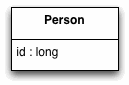

Identity Field

Saves a database ID field in an object to maintain identity between an in-memory object and a database row.

For a full description see P of EAA page 216

 
Relational databases tell one row from another by using key - in particular, the primary key. However, in-memory objects don't need such a key, as the object system ensures the correct identity under the covers (or in C++'s case with raw memory locations). Reading data from a database is all very well, but in order to write data back you need to tie the database to the in-memory object system.

In essence, Identity Field is mind-numbingly simple. All you do is store the primary key of the relational database table in the object's fields.