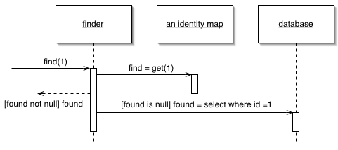

Identity Map

Ensures that each object gets loaded only once by keeping every loaded object in a map. Looks up objects using the map when referring to them.

For a full description see P of EAA page 195

 

An old proverb says that a man with two watches never knows what time it is. If two watches are confusing, you can get in an even bigger mess with loading objects from a database. If you aren't careful you can load the data from the same database record into two different objects. Then, when you update them both you'll have an interesting time writing the changes out to the database correctly.

Related to this is an obvious performance problem. If you load the same data more than once you're incurring an expensive cost in remote calls. Thus, not loading the same data twice doesn't just help correctness, but can also speed up your application.

An Identity Map keeps a record of all objects that have been read from the database in a single business transaction. Whenever you want an object, you check the Identity Map first to see if you already have it.