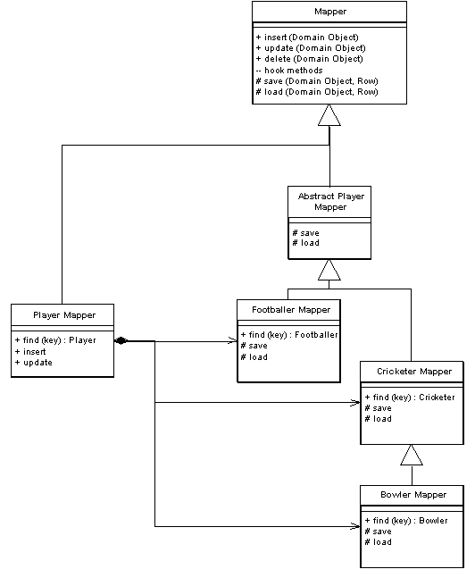

Inheritance Mappers

A structure to organize database mappers that handle inheritance hierarchies.

For a full description see P of EAA page 302

 

When you map from an object-oriented inheritance hierarchy in memory to a relational database you have to minimize the amount of code needed to save and load the data to the database. You also want to provide both abstract and concrete mapping behavior that allows you to save or load a superclass or a subclass.

Although the details of this behavior vary with your inheritance mapping scheme (Single Table Inheritance (278), Class Table Inheritance (285), and Concrete Table Inheritance (293)) the general structure works the same for all of them.