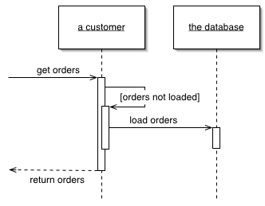

Lazy Load

An object that doesn't contain all of the data you need but knows how to get it.

For a full description see P of EAA page 200

For loading data from a database into memory it's handy to design things so that as you load an object of interest you also load the objects that are related to it. This makes loading easier on the developer using the object, who otherwise has to load all the objects he needs explicitly.

However, if you take this to its logical conclusion, you reach the point where loading one object can have the effect of loading a huge number of related objects - something that hurts performance when only a few of the objects are actually needed.

A Lazy Load interrupts this loading process for the moment, leaving a marker in the object structure so that if the data is needed it can be loaded only when it is used. As many people know, if you're lazy about doing things you'll win when it turns out you don't need to do them at all.

There are four main varieties of lazy load. Lazy Initialization uses a special marker value (usually null) to indicate a field isn't loaded. Every access to the field checks the field for the marker value and if unloaded, loads it. Virtual Proxy is an object with the same interface as the real object. The first time one of its methods are called it loads the real object and then delegates. Value Holder is an object with a getValue method. Clients call getValue to get the real object, the first call triggers the load. A ghost is the real object without any data. The first time you call a method the ghost loads the full data into its fields.

These approaches vary somewhat subtly and have various trade-offs. You can also use combination approaches. The book contains the full discussion and examples.