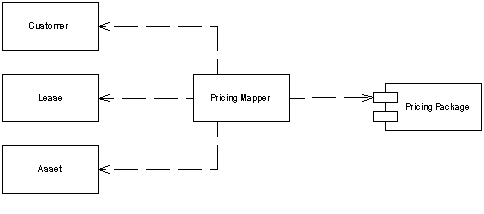

Mapper

An object that sets up a communication between two independent objects.

For a full description see P of EAA page 473

 

Sometimes you need to set up communications between two subsystems that still need to stay ignorant of each other. This may be because you can't modify them or you can but you don't want to create dependencies between the two or even between them and the isolating element.