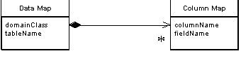

Metadata Mapping

Holds details of object-relational mapping in metadata.

For a full description see P of EAA page 306

 

Much of the code that deals with object-relational mapping describes how fields in the database correspond to fields in in-memory objects. The resulting code tends to be tedious and repetitive to write. A Metadata Mapping allows developers to define the mappings in a simple tabular form, which can then be processed by generic code to carry out the details of reading, inserting, and updating the data.