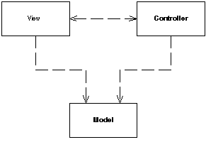

Model View Controller

Splits user interface interaction into three distinct roles.

For a full description see P of EAA page 330

Controller Model View Controller (MVC) is one of the most quoted (and most misquoted) patterns around. It started as a framework developed by Trygve Reenskaug for the Smalltalk platform in the late 1970s. Since then it has played an influential role in most UI frameworks and in the thinking about UI design.