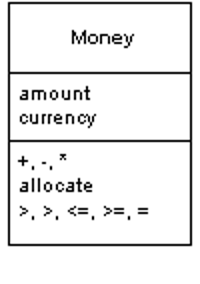

Money

Represents a monetary value.

For a full description see P of EAA page 488

A large proportion of the computers in this world manipulate money, so it's always puzzled me that money isn't actually a first class data type in any mainstream programming language. The lack of a type causes problems, the most obvious surrounding currencies. If all your calculations are done in a single currency, this isn't a huge problem, but once you involve multiple currencies you want to avoid adding your dollars to your yen without taking the currency differences into account. The more subtle problem is with rounding. Monetary calculations are often rounded to the smallest currency unit. When you do this it's easy to lose pennies (or your local equivalent) because of rounding errors.

The good thing about object-oriented programming is that you can fix these problems by creating a Money class that handles them. Of course, it's still surprising that none of the mainstream base class libraries actually do this.