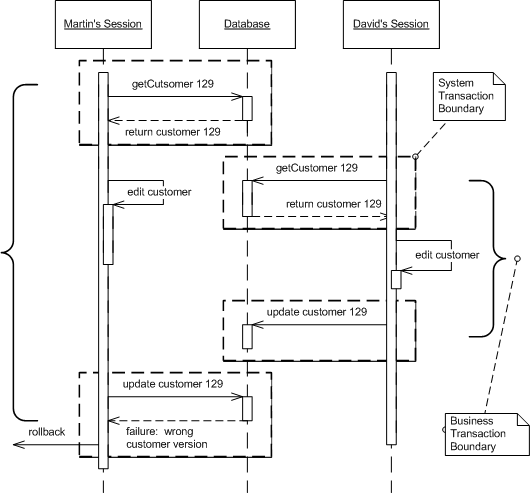

Optimistic Offline Lock

by David Rice

Prevents conflicts between concurrent business transactions by detecting a conflict and rolling back the transaction.

For a full description see P of EAA page 416

Often a business transaction executes across a series of system transactions. Once outside the confines of a single system transaction, we can't depend on our database manager alone to ensure that the business transaction will leave the record data in a consistent state. Data integrity is at risk once two sessions begin to work on the same records and lost updates are quite possible. Also, with one session editing data that another is reading an inconsistent read becomes likely.

Optimistic Offline Lock solves this problem by validating that the changes about to be committed by one session don't conflict with the changes of another session. A successful pre-commit validation is, in a sense, obtaining a lock indi-cating it's okay to go ahead with the changes to the record data. So long as the validation and the updates occur within a single system transaction the business transaction will display consistency.

Whereas Pessimistic Offline Lock (426) assumes that the chance of session conflict is high and therefore limits the system's concurrency, Optimistic Offline Lock assumes that the chance of conflict is low. The expectation that session con-flict isn't likely allows multiple users to work with the same data at the same time.