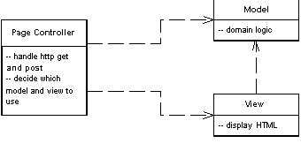

Page Controller

An object that handles a request for a specific page or action on a Web site.

For a full description see P of EAA page 333

 

Most people's basic Web experience is with static HTML pages. When you request static HTML you pass to the Web server the name and path for a HTML document stored on it. The key notion is that each page on the Web site is a separate document on the server. With dynamic pages things can get much more interesting since there's a much more complex relationship between path names and the file that responds. However, the approach of one path leading to one file that handles the request is a simple model to understand.

As a result, Page Controller has one input controller for each logical page of the Web site. That controller may be the page itself, as it often is in server page environments, or it may be a separate object that corresponds to that page.