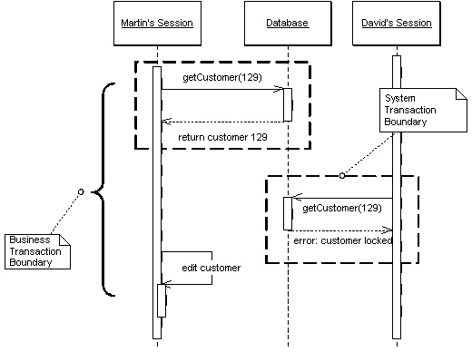

Pessimistic Offline Lock

by David Rice

Prevents conflicts between concurrent business transactions by allowing only one business transaction at a time to access data.

For a full description see P of EAA page 426

 

Since offline concurrency involves manipulating data for a business transaction that spans multiple requests, the simplest approach would seem to be having a system transaction open for the whole business transaction. Sadly, however, this doesn't always work well because transaction systems aren't geared to work with long transactions. For that reason you have to use multiple system transactions, at which point you're left to your own devices to manage concurrent access to your data.

The first approach to try is Optimistic Offline Lock (416). However, that pattern has its problems. If several people access the same data within a busi-ness transaction, one of them will commit easily but the others will conflict and fail. Since the conflict is only detected at the end of the business transac-tion, the victims will do all the transaction work only to find at the last minute that the whole thing will fail and their time will have been wasted. If this hap-pens a lot on lengthy business transactions the system will soon become very unpopular.

Pessimistic Offline Lock prevents conflicts by avoiding them altogether. It forces a business transaction to acquire a lock on a piece of data before it starts to use it, so that, most of the time, once you begin a business transaction you can be pretty sure you'll complete it without being bounced by concurrency control.