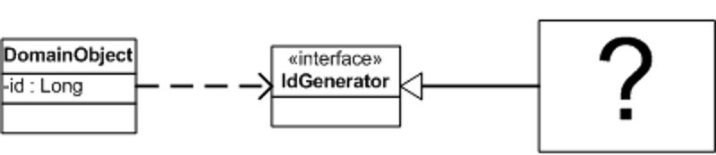

Plugin

by David Rice and Matt Foemmel

Links classes during configuration rather than compilation.

For a full description see P of EAA page 499

 

Separated Interface (476) is often used when application code runs in multiple runtime environments, each requiring different implementations of particular behavior. Most developers supply the correct implementation by writing a fac-tory method. Suppose you define your primary key generator with a Separated Interface (476) so that you can use a simple in-memory counter for unit testing but a database-managed sequence for production. Your factory method will most likely contain a conditional statement that looks at a local environment variable, determines if the system is in test mode, and returns the correct key generator. Once you have a few factories you have a mess on your hands. Establishing a new deployment configuration - say "execute unit tests against in-memory database without transaction control" or "execute in production mode against DB2 database with full transaction control" - requires editing conditional statements in a number of factories, rebuilding, and redeploying. Configuration shouldn't be scattered throughout your application, nor should it require a rebuild or redeployment. Plugin solves both problems by providing centralized, runtime configuration.