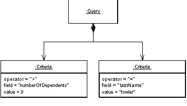

Query Object

An object that represents a database query.

For a full description see P of EAA page 316

 

SQL can be an involved language, and many developers aren't particularly familiar with it. Furthermore, you need to know what the database schema looks like to form queries. You can avoid this by creating specialized finder methods that hide the SQL inside parameterized methods, but that makes it dif-ficult to form more ad hoc queries. It also leads to duplication in the SQL state-ments should the database schema change.

A Query Object is an interpreter [Gang of Four], that is, a structure of objects that can form itself into a SQL query. You can create this query by refer-ring to classes and fields rather than tables and columns. In this way those who write the queries can do so independently of the database schema and changes to the schema can be localized in a single place.