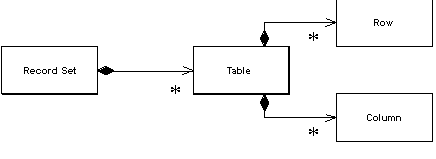

Record Set

An in-memory representation of tabular data.

For a full description see P of EAA page 508

 

In the last twenty years, the dominant way to represent data in a database has been the tabular relational form. Backed by database companies big and small, and a fairly standard query language, almost every new development I see uses relational data.

On top of this has come a wealth of tools for building UI's quickly. These data-aware UI frameworks rely on the fact that the underlying data is rela-tional, and they provide UI widgets of various kinds that make it easy to view and manipulate this data with almost no programming.

The dark side of these environments is that, while they make display and simple updates ridiculously easy, they have no real facilities in which to place business logic. Any validations beyond "is this a valid date," and any business rules or computations have no good place to go. Either they're jammed into the database as stored procedures or they're mingled with UI code.

The idea of the Record Set is to give you your cake and let you eat it, by pro-viding an in-memory structure that looks exactly like the result of an SQL query but can be generated and manipulated by other parts of the system.