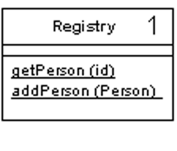

Registry

A well-known object that other objects can use to find common objects and services.

For a full description see P of EAA page 480

When you want to find an object you usually start with another object that has an association to it, and use the association to navigate to it. Thus, if you want to find all the orders for a customer, you start with the customer object and use a method on it to get the orders. However, in some cases you won't have an appropriate object to start with. You may know the customer's ID number but not have a reference. In this case you need some kind of lookup method - a finder - but the question remains: How do you get to the finder?

A Registry is essentially a global object, or at least it looks like one - even if it isn't as global as it may appear.