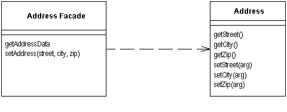

Remote Facade

Provides a coarse-grained facade on fine-grained objects to improve efficiency over a network.

For a full description see P of EAA page 388

 

Remote Facade In an object-oriented model, you do best with small objects that have small methods. This gives you lots of opportunity for control and substitution of behavior, and to use good intention revealing naming to make an application easier to understand. One of the consequences of such fine-grained behavior is that there's usually a great deal of interaction between objects, and that interac-tion usually requires lots of method invocations.

Within a single address space fine-grained interaction works well, but this happy state does not exist when you make calls between processes. Remote calls are much more expensive because there's a lot more to do: Data may have to be marshaled, security may need to be checked, packets may need to be routed through switches. If the two processes are running on machines on opposite sides of the globe, the speed of light may be a factor. The brutal truth is that any inter-process call is orders of magnitude more expensive than an in-process call - even if both processes are on the same machine. Such a perfor-mance effect cannot be ignored, even for believers in lazy optimization.

As a result any object that's intended to be used as a remote objects needs a coarse-grained interface that minimizes the number of calls needed to get some-thing done. Not only does this affect your method calls, it also affects your objects. Rather than ask for an order and its order lines individually, you need to access and update the order and order lines in a single call. This affects your entire object structure. You give up the clear intention and fine-grained control you get with small objects and small methods. Programming becomes more dif-ficult and your productivity slows.

A Remote Facade is a coarse-grained facade [Gang of Four] over a web of fine-grained objects. None of the fine-grained objects have a remote interface, and the Remote Facade contains no domain logic. All the Remote Facade does is translate coarse-grained methods onto the underlying fine-grained objects.