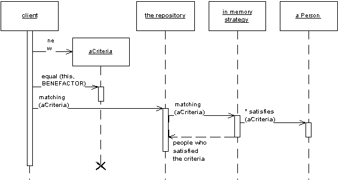

Repository

by Edward Hieatt and Rob Mee

Mediates between the domain and data mapping layers using a collection-like interface for accessing domain objects.

For a full description see P of EAA page 322

 

A system with a complex domain model often benefits from a layer, such as the one provided by Data Mapper (165), that isolates domain objects from details of the database access code. In such systems it can be worthwhile to build another layer of abstraction over the mapping layer where query construction code is concentrated. This becomes more important when there are a large number of domain classes or heavy querying. In these cases particularly, adding this layer helps minimize duplicate query logic.

A Repository mediates between the domain and data mapping layers, acting like an in-memory domain object collection. Client objects construct query specifications declaratively and submit them to Repository for satisfaction. Objects can be added to and removed from the Repository, as they can from a simple collection of objects, and the mapping code encapsulated by the Repository will carry out the appropriate operations behind the scenes. Conceptually, a Repository encapsulates the set of objects persisted in a data store and the operations performed over them, providing a more object-oriented view of the persistence layer. Repository also supports the objective of achieving a clean separation and one-way dependency between the domain and data mapping layers.

You can also find a good write-up of this pattern in Domain Driven Design.