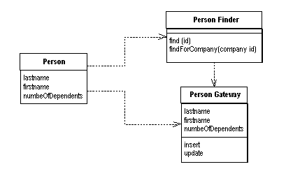

Row Data Gateway

An object that acts as a Gateway (466) to a single record in a data source. There is one instance per row.

Embedding database access code in in-memory objects can leave you with a few disadvantages. For a start, if your in-memory objects have business logic of their own, adding the database manipulation code increases complexity. Testing is awkward too since, if your in-memory objects are tied to a database, tests are slower to run because of all the database access. You may have to access multiple databases with all those annoying little variations on their SQL.

A Row Data Gateway gives you objects that look exactly like the record in your record structure but can be accessed with the regular mechanisms of your programming language. All details of data source access are hidden behind this interface.

