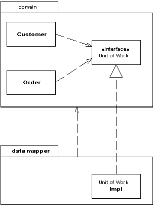

Separated Interface

Defines an interface in a separate package from its implementation.

For a full description see P of EAA page 476

 

As you develop a system, you can improve the quality of its design by reducing the coupling between the system's parts. A good way to do this is to group the classes into packages and control the dependencies between them.You can then follow rules about how classes in one package can call classes in another - for example, one that says that classes in the domain layer may not call classes in the presentation package.

However, you might need to invoke methods that contradict the general dependency structure. If so, use Separated Interface to define an interface in one package but implement it in another. This way a client that needs the dependency to the interface can be completely unaware of the implementation. The Separated Interface provides a good plug point for Gateway (466).