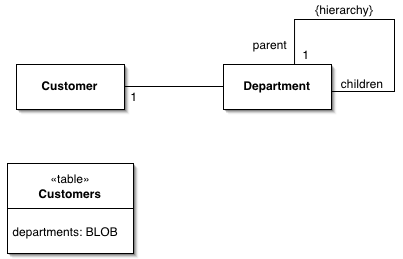

Serialized LOB

Saves a graph of objects by serializing them into a single large object (LOB), which it stores in a database field.

For a full description see P of EAA page 272

Object models often contain complicated graphs of small objects. Much of the information in these structures isn't in the objects but in the links between them. Consider storing the organization hierarchy for all your customers. An object model quite naturally shows the composition pattern to represent orga-nizational hierarchies, and you can easily add methods that allow you to get ancestors, siblings, descendents, and other common relationships.

Not so easy is putting all this into a relational schema. The basic schema is simple - an organization table with a parent foreign key, however, its manipula-tion of the schema requires many joins, which are both slow and awkward.

Objects don't have to be persisted as table rows related to each other. Another form of persistence is serialization, where a whole graph of objects is written out as a single large object (LOB) in a table this Serialized LOB then becomes a form of memento [Gang of Four].