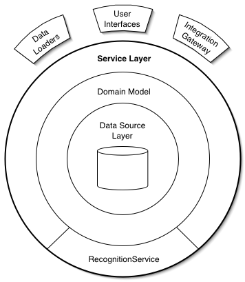

Service Layer

Defines an application's boundary with a layer of services that establishes a set of available operations and coordinates the application's response in each operation.

Enterprise applications typically require different kinds of interfaces to the data they store and the logic they implement: data loaders, user interfaces, integration gateways, and others. Despite their different purposes, these interfaces often need common interactions with the application to access and manipulate its data and invoke its business logic. The interactions may be complex, involv-ing transactions across multiple resources and the coordination of several responses to an action. Encoding the logic of the interactions separately in each interface causes a lot of duplication.

A Service Layer defines an application's boundary [Cockburn PloP] and its set of available operations from the perspective of interfacing client layers. It encapsulates the application's business logic, controlling transactions and coor-dinating responses in the implementation of its operations.