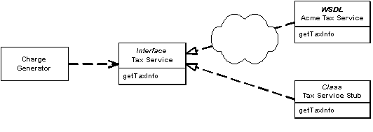

Service Stub

by David Rice

Removes dependence upon problematic services during testing. WSDL

For a full description see P of EAA page 504

 

Enterprise systems often depend on access to third-party services such as credit scoring, tax rate lookups, and pricing engines. Any developer who has built such a system can speak to the frustration of being dependent on resources completely out of his control. Feature delivery is unpredictable, and as these services are often remote reliability and performance can suffer as well.

At the very least these problems slow the development process. Developers sit around waiting for the service to come back on line or maybe put some hacks into the code to compensate for yet to be delivered features. Much worse, and quite likely, such dependencies will lead to times when tests can't execute. When tests can't run the development process is broken.

Replacing the service during testing with a Service Stub that runs locally, fast, and in memory improves your development experience.