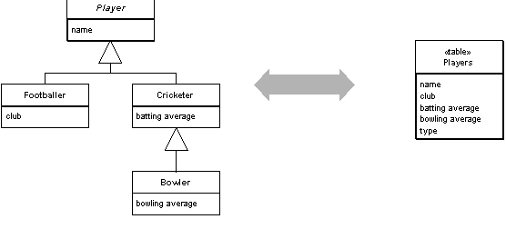

Single Table Inheritance

Represents an inheritance hierarchy of classes as a single table that has columns for all the fields of the various classes.

For a full description see P of EAA page 278

 

Relational databases don't support inheritance, so when mapping from objects to databases we have to consider how to represent our nice inheritance struc-tures in relational tables. When mapping to a relational database, we try to minimize the joins that can quickly mount up when processing an inheritance structure in multiple tables. Single Table Inheritance maps all fields of all classes of an 