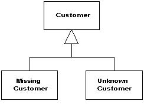

Special Case

A subclass that provides special behavior for particular cases.

For a full description see P of EAA page 496

Nulls are awkward things in object-oriented programs because they defeat polymorphism. Usually you can invoke foo freely on a variable reference of a given type without worrying about whether the item is the exact type or a sub-class. With a strongly typed language you can even have the compiler check that the call is correct. However, since a variable can contain null, you may run into a runtime error by invoking a message on null, which will get you a nice, friendly stack trace.

If it's possible for a variable to be null, you have to remember to surround it with null test code so you'll do the right thing if a null is present. Often the right thing is same in many contexts, so you end up writing similar code in lots of places - committing the sin of code duplication.

Nulls are a common example of such problems and others crop up regularly. In number systems you have to deal with infinity, which has special rules for things like addition that break the usual invariants of real numbers. One of my earliest experiences in business software was with a utility customer who wasn't fully known, referred to as "occupant." All of these imply altering the usual behavior of the type.

Instead of returning null, or some odd value, return a Special Case that has the same interface as what the caller expects.