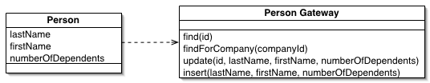

Table Data Gateway

An object that acts as a Gateway (466) to a database table. One instance handles all the rows in the table.

Mixing SQL in application logic can cause several problems. Many developers aren't comfortable with SQL, and many who are comfortable may not write it well. Database administrators need to be able to find SQL easily so they can figure out how to tune and evolve the database.

A Table Data Gateway holds all the SQL for accessing a single table or view: selects, inserts, updates, and deletes. Other code calls its methods for all interaction with the database.