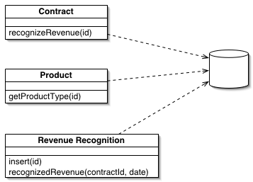

Table Module

A single instance that handles the business logic for all rows in a database table or view.

One of the key messages of object orientation is bundling the data with the behavior that uses it. The traditional object-oriented approach is based on objects with identity, along the lines of Domain Model (116). Thus, if we have an Employee class, any instance of it corresponds to a particular employee. This scheme works well because once we have a reference to an employee, we can execute operations, follow relationships, and gather data on him.

One of the problems with Domain Model (116) is the interface with relational databases. In many ways this approach treats the relational database like a crazy aunt who's shut up in an attic and whom nobody wants to talk about. As a result you often need considerable programmatic gymnastics to pull data in and out of the database, transforming between two different representations of the data.

A Table Module organizes domain logic with one class per table in the data-base, and a single instance of a class contains the various procedures that will act on the data. The primary distinction with Domain Model (116) is that, if you have many orders, a Domain Model (116) will have one order object per order while a Table Module will have one object to handle all orders.