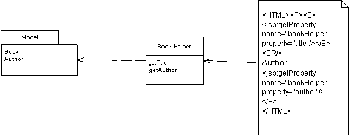

Template View

Renders information into HTML by embedding markers in an HTML page.

For a full description see P of EAA page 350

 

Writing a program that spits out HTML is often more difficult than you might imagine. Although programming languages are better at creating text than they used to be (some of us remember character handling in Fortran and stan-dard Pascal), creating and concatenating string constructs is still painful. If there isn't much to do, it isn't too bad, but a whole HTML page is a lot of text manipulation.

With static HTML pages - those that don't change from request to request - you can use nice WYSIWG editors. Even those of us who like raw text editors find it easier to just type in the text and tags rather than fiddle with string con-catenation in a programming language.

Of course the issue is with dynamic Web pages - those that take the results of something like database queries and embed them into the HTML. The page looks different with each result, and as a result regular HTML editors aren't up to the job.

The best way to work is to compose the dynamic Web page as you do a static page but put in markers that can be resolved into calls to gather dynamic information. Since the static part of the page acts as a template for the particular response, I call this a Template View.