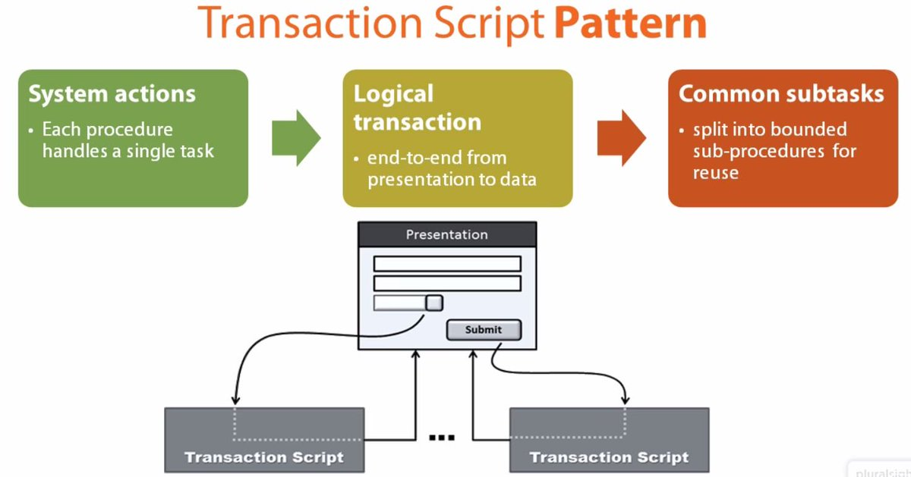

Transaction Script

Organizes business logic by procedures where each procedure handles a single request from the presentation.

For a full description see P of EAA page 110

 

Most business applications can be thought of as a series of transactions. A transaction may view some information as organized in a particular way, another will make changes to it. Each interaction between a client system and a server system contains a certain amount of logic. In some cases this can be as simple as displaying information in the database. In others it may involve many steps of validations and calculations.

A Transaction Script organizes all this logic primarily as a single procedure, making calls directly to the database or through a thin database wrapper. Each transaction will have its own Transaction Script, although common subtasks can be broken into subprocedures.

