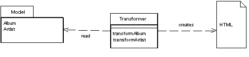

Transform View

A view that processes domain data element by element and transforms it into HTML.

For a full description see P of EAA page 361

 

Transform When you issue requests for data to the domain and data source layers, you get back all the data you need to satisfy them, but without the formatting you need to make a proper Web page. The role of the view in Model View Controller (330) is to render this data into a Web page. Using Transform View means thinking of this as a transformation where you have the model's data as input and its HTML as output.