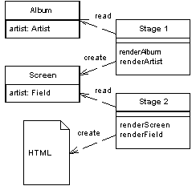

Two Step View

Turns domain data into HTML in two steps: first by forming some kind of logical page, then rendering the logical page into HTML.

For a full description see P of EAA page 365

 

If you have a Web application with many pages, you often want a consistent look and organization to the site. If every page looks different, you end up with a site that users find confusing. You may also want to make global changes to the appearance of the site easily, but common approaches using Template View (350) or Transform View (361) make this difficult because presentation decisions are often duplicated across multiple pages or transform modules. A global change can force you to change several files.

Two Step View deals with this problem by splitting the transformation into two stages. The first transforms the model data into a logical presentation without any specific formatting; the second converts that logical presentation with the actual formatting needed. This way you can make a global change by altering the second stage, or you can support multiple output looks and feels with one second stage each.