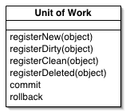

Unit of Work

Maintains a list of objects affected by a business transaction and coordinates the writing out of changes and the resolution of concurrency problems.

For a full description see P of EAA page 184

 

When you're pulling data in and out of a database, it's important to keep track of what you've changed; otherwise, that data won't be written back into the database. Similarly you have to insert new objects you create and remove any objects you delete.

You can change the database with each change to your object model, but this can lead to lots of very small database calls, which ends up being very slow. Furthermore it requires you to have a transaction open for the whole interaction, which is impractical if you have a business transaction that spans multiple requests. The situation is even worse if you need to keep track of the objects you've read so you can avoid inconsistent reads.

A Unit of Work keeps track of everything you do during a business transaction that can affect the database. When you're done, it figures out everything that needs to be done to alter the database as a result of your work.